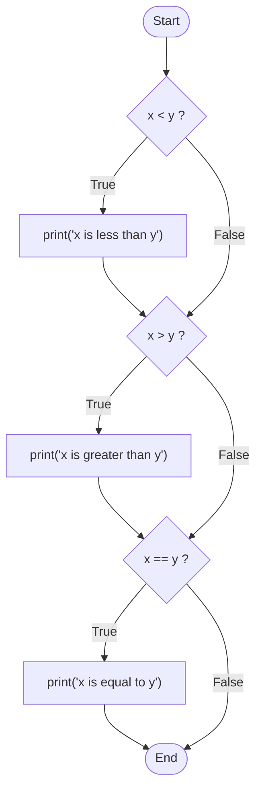
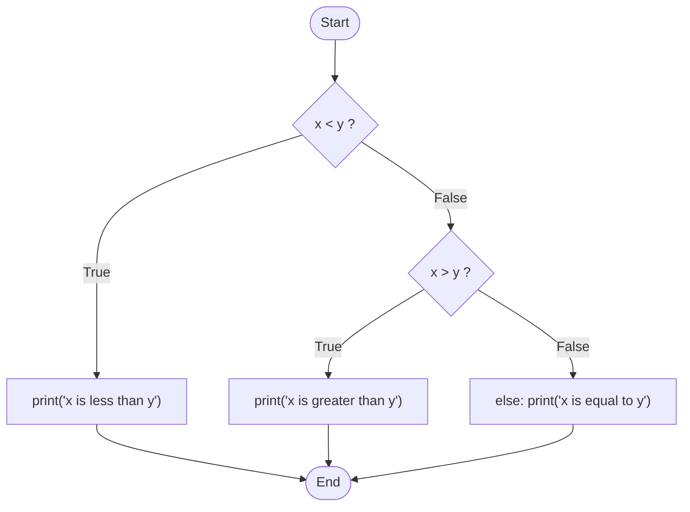
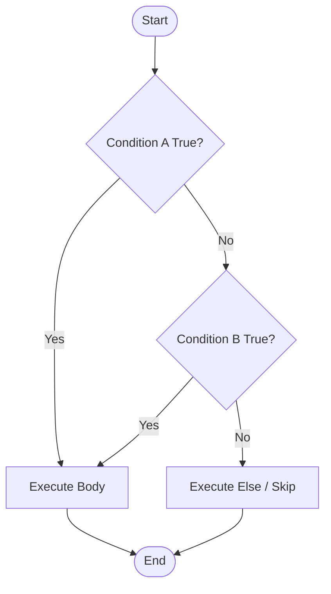
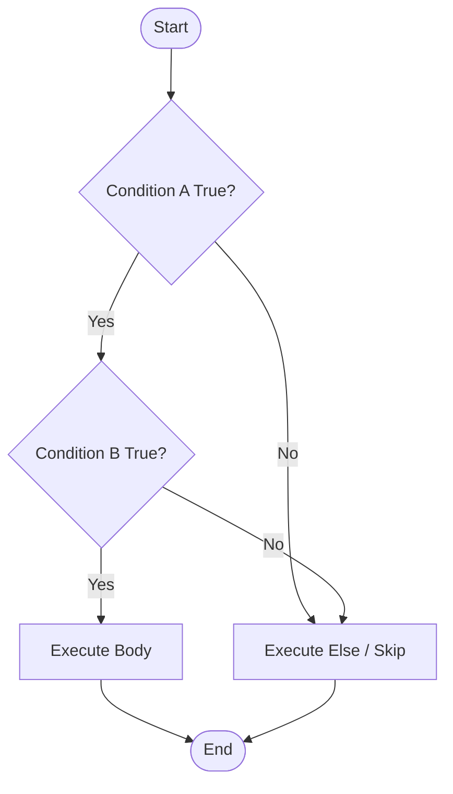
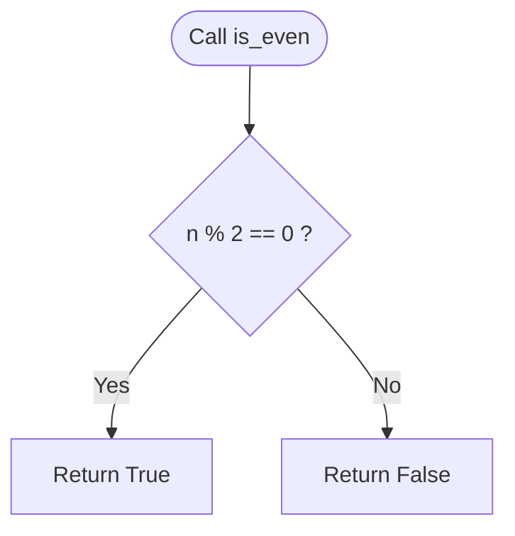
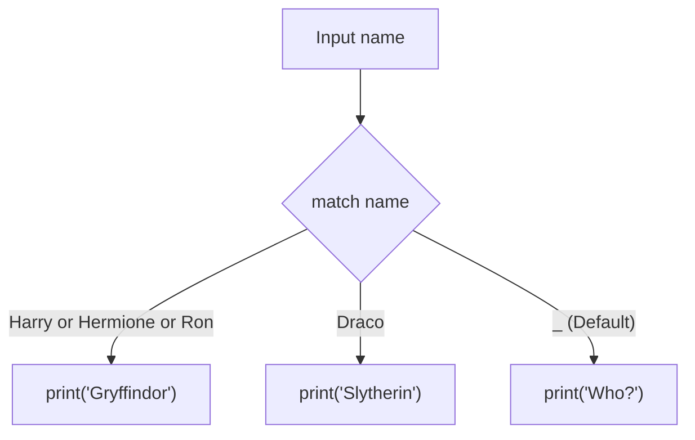

# CS50P: Lecture Notes & Setup Guide

---

## Lecture 1: Conditionals

Conditionals allow programs to make decisions by executing specific blocks of code depending on whether a given condition is true or false.

### Comparison Operators

Python supports standard comparison operators that evaluate to a **Boolean** (`True` or `False`):

* `>` Greater than
* `>=` Greater than or equal to
* `<` Less than
* `<=` Less than or equal to
* `==` Equal to
* `!=` Not equal to

---

### Control Flow Maps: `if`, `elif`, and `else`

#### 1. Independent `if` Statements
When using multiple independent `if` statements, Python evaluates **every single condition**, even if earlier conditions are already true:



```python
x = int(input("What's x? "))
y = int(input("What's y? "))

if x < y:
    print("x is less than y")
if x > y:
    print("x is greater than y")
if x == y:
    print("x is equal to y")
```

---

#### 2. Mutually Exclusive Branches: `if` / `elif` / `else`
Using `elif` and `else` links conditions together into a single pipeline. As soon as one branch evaluates to `True`, the remaining checks are completely skipped:



```python
if x < y:
    print("x is less than y")
elif x > y:
    print("x is greater than y")
else:
    print("x is equal to y")
```

---

### Logical Operators: `or` and `and`

#### 1. The `or` Operator
The `or` keyword evaluates to `True` if **at least one** condition is true. If the first condition passes, Python performs short-circuit evaluation and skips the second:



**Truth Table (`or`):**

| A | B | A or B |
|---|---|--------|
| `True` | `True` | `True` |
| `True` | `False` | `True` |
| `False` | `True` | `True` |
| `False` | `False` | `False` |

```python
# Check inequality directly instead of chaining or checks
if x != y:
    print("x is not equal to y")
else:
    print("x is equal to y")
```

---

#### 2. The `and` Operator
The `and` keyword evaluates to `True` **only if both** conditions are true. If the first condition is false, Python stops immediately:



**Truth Table (`and`):**

| A | B | A and B |
|---|---|---------|
| `True` | `True` | `True` |
| `True` | `False` | `False` |
| `False` | `True` | `False` |
| `False` | `False` | `False` |

```python
score = int(input("Score: "))

# Succinct check relying on evaluation order:
if score >= 90:
    print("Grade: A")
elif score >= 80:
    print("Grade: B")
elif score >= 70:
    print("Grade: C")
elif score >= 60:
    print("Grade: D")
else:
    print("Grade: F")
```

---

### Modulo Operator and Pythonic Functions

The modulo operator `%` calculates the remainder of division, making it ideal for parity checks:



```python
def main():
    x = int(input("What's x? "))
    if is_even(x):
        print("Even")
    else:
        print("Odd")

# Pythonic and direct:
def is_even(n):
    return n % 2 == 0

main()
```

---

### `match` Statements

Python 3.10 introduced `match` statements for clean pattern-matching without long `elif` chains:



```python
name = input("What's your name? ")

match name:
    case "Harry" | "Hermione" | "Ron":
        print("Gryffindor")
    case "Draco":
        print("Slytherin")
    case _:
        print("Who?")
```