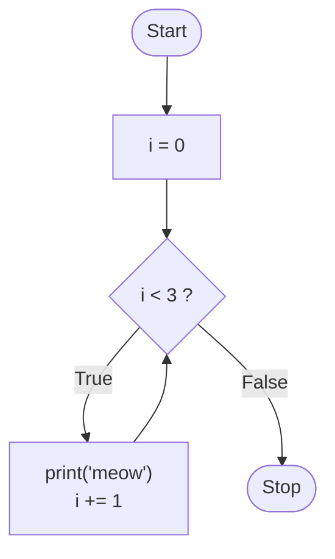
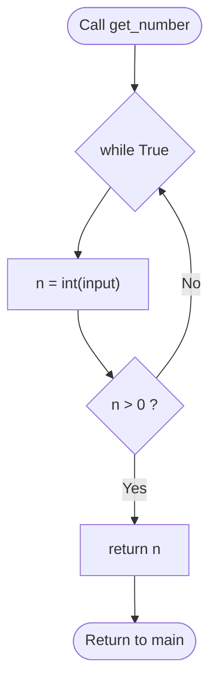
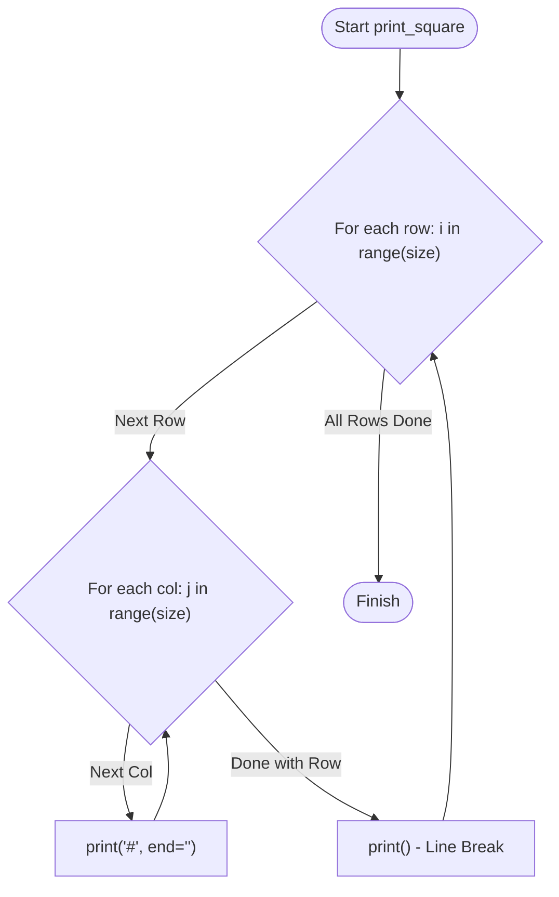

# CS50P: Lecture Notes & Setup Guide

---

## Lecture 2: Loops

Loops provide a way to repeat a block of code multiple times without redundantly retyping statements.

---

### `while` Loops

A `while` loop repeatedly executes its indented code block as long as its condition evaluates to `True`.

#### Basic Counter Example
```python
i = 0
while i < 3:
    print("meow")
    i += 1
```

* **Best Practice:** In computer science, zero-indexed counting (starting at `0`) is standard.
* `i += 1` increments `i` by `1` on each iteration (syntactic sugar for `i = i + 1`).
* If the loop condition never becomes `False`, the loop runs infinitely. You can press `Ctrl + C` in the terminal to force terminate a runaway program.

#### While Loop Flowchart



---

### `for` Loops & `range()`

A `for` loop iterates sequentially through a collection or sequence of items.

#### Iterating Over a List
```python
for i in [0, 1, 2]:
    print("meow")
```

#### Using `range()`
Manually typing lists becomes unmanageable for large numbers. `range(n)` automatically produces an iterable sequence of numbers from `0` up to, but not including, `n` (exclusive of `n`):

```python
for i in range(3):
    print("meow")
```

#### The Pythonic Underscore (`_`)
If the loop iteration variable is not actually referenced inside the loop body, assign it to an underscore `_` by convention:

```python
for _ in range(3):
    print("meow")
```

#### Repeating Strings
Python allows string multiplication to repeat characters without a loop:

```python
# Multiplies the string and prevents an unnecessary extra trailing newline
print("meow\n" * 3, end="")
```

---

### Input Validation: `break` and `continue`

Loops can validate user input dynamically by forcing prompts until valid data is entered:

```python
while True:
    n = int(input("What's n? "))
    if n > 0:
        break

for _ in range(n):
    print("meow")
```

* `continue` immediately jumps to the next cycle of the loop.
* `break` immediately escapes the enclosing loop entirely.

#### Validating Input Inside Functions



```python
def main():
    number = get_number()
    meow(number)

def get_number():
    while True:
        n = int(input("What's n? "))
        if n > 0:
            return n

def meow(n):
    for _ in range(n):
        print("meow")

main()
```
*`return` automatically breaks out of both the loop and the enclosing function in a single action.*

---

### Lists (`list`) and `len()`

A `list` is an ordered, zero-indexed sequence of values enclosed in square brackets `[]`.

```python
students = ["Hermione", "Harry", "Ron"]

# Direct element iteration:
for student in students:
    print(student)

# Index-based iteration using len():
for i in range(len(students)):
    print(i + 1, students[i])
```
* `len(students)` dynamically returns the number of items currently in the list (`3`).

---

### Dictionaries (`dict`)

A `dict` associates **keys** with corresponding **values**, enclosed in curly braces `{}`.

#### Basic Key-Value Lookups
```python
students = {
    "Hermione": "Gryffindor",
    "Harry": "Gryffindor",
    "Ron": "Gryffindor",
    "Draco": "Slytherin",
}

# Iterating over dictionary keys and accessing values:
for student in students:
    print(student, students[student], sep=", ")
```

#### List of Dictionaries (Tabular Data)
When each entity possesses multiple attributes, use a list where each element is a dictionary:

```python
students = [
    {"name": "Hermione", "house": "Gryffindor", "patronus": "Otter"},
    {"name": "Harry", "house": "Gryffindor", "patronus": "Stag"},
    {"name": "Ron", "house": "Gryffindor", "patronus": "Jack Russell terrier"},
    {"name": "Draco", "house": "Slytherin", "patronus": None},
]

for student in students:
    print(student["name"], student["house"], student["patronus"], sep=", ")
```
* `None` represents the intentional absence of a value.

---

### Nested Loops & 2D Grid Abstraction (Mario)

#### 1. Vertical Columns
```python
def print_column(height):
    for _ in range(height):
        print("#")
```

#### 2. Horizontal Rows
```python
def print_row(width):
    print("?" * width)
```

#### 3. 2D Grids with Nested Loops
A 2D square requires iterating over rows (outer loop) and columns/bricks per row (inner loop):



```python
def print_square(size):
    for i in range(size):
        for j in range(size):
            print("#", end="")
        print()
```

#### 4. Clean Abstraction (Functional Decomposition)
Rather than writing nested loops directly, abstract row construction into a helper function:

```python
def main():
    print_square(3)

def print_square(size):
    for _ in range(size):
        print_row(size)

def print_row(width):
    print("#" * width)

main()
```